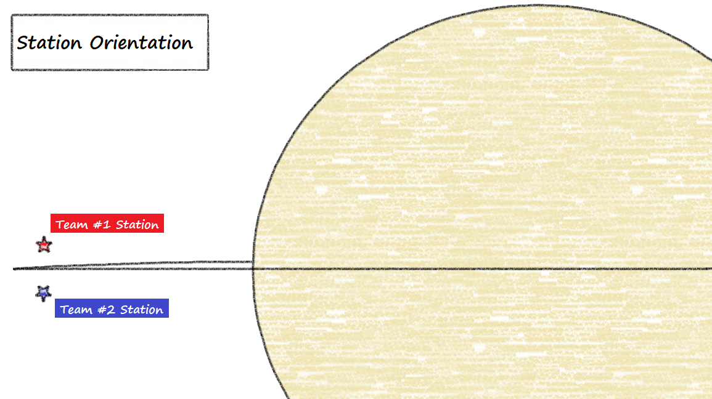
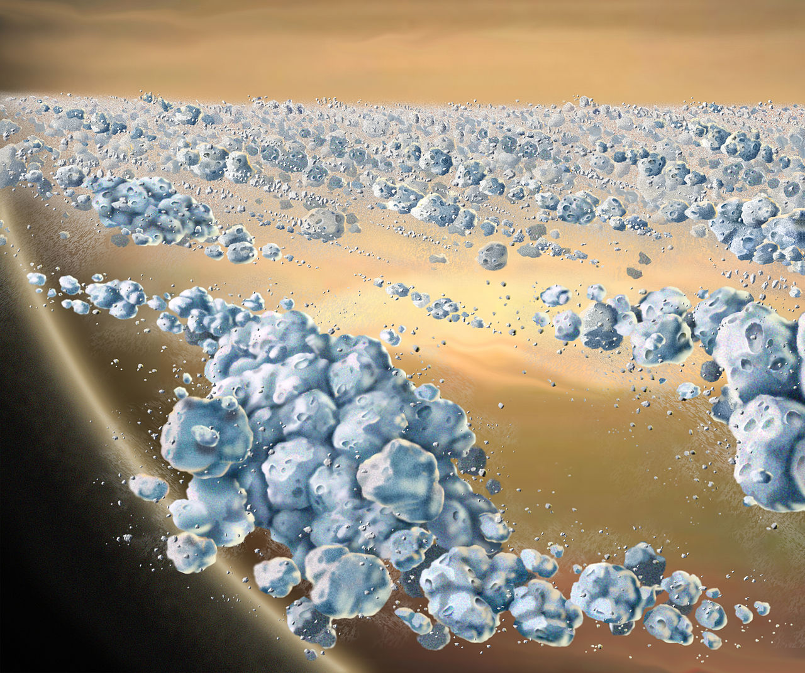
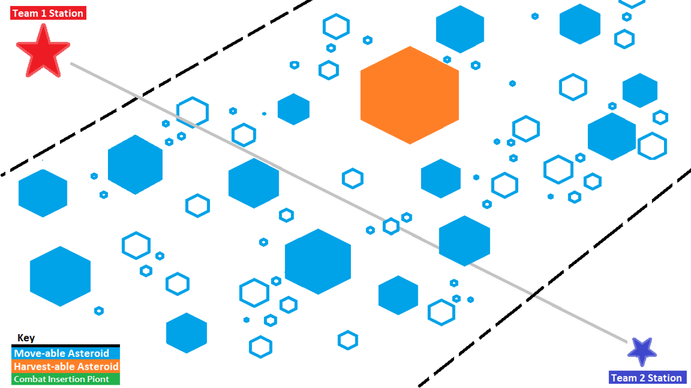

# **Open-Space-Game** 
_Open World, Open Space, Open Source :tm:_

This is the design document for the first Campaign for the open-space-game project.  This initial Campaign is more for getting the foundation laid for features that will come later.  The end result of this Campaign should be a multi-player game where two groups fight for control of contested areas.

# Table of Contents
* [Feature Set](#feature-set)
  * [General Features](#general-features)
  * [Multi-player Features](#multi-player-features)
  * [Editor](#editor)
  * [Game play](#game-play)
* [The Game World](#the-game-world)
  * [The Physical World](#the-physical-world)
  * [Camera](#camera)
* [The World Layout](#the-world-layout)
* [Game Characters](#game-characters)
  * [Creating a Character](#creating-a-character)
* [User Interface](#user-interface)
* [Musical Scores and Sound Effects](#musical-scores-and-sound-effects)
  * [Sound Track](#sound-track)
  * [Sound FX](#sound-fx)

# Feature Set

The following is a general overview of what a potential player can expect to find when they start playing open-space-game.

## General Features

* 3D Graphics
* Real-time physics

## Multi-player Features

* Co-Operative/Competitive Game Play
* Host Finder
* Team/Global Communication

## Editor

* Allow additional assets to be created
* Easy to Use

## Game-play

* Players control a single drone ship, of three possible ship types, which they choose before they enter the war-zone.  The ships will be controlled using chemical engines and will follow physical rules ([Asteroids](https://en.wikipedia.org/wiki/Asteroids_(video_game))) versus arcade rules ([Galaga](https://en.wikipedia.org/wiki/Galaga)).

* Players earn credits by destroying opposing team ships who's payout is calculated by a minimum payment plus a bonus based on the player's rank.  NPC kills always payout the same pay, based on their AI tier.

* Asteroids are interactive with ship weaponry, allowing the player to change the asteroids direction and/or break off pieces that can cause damage to other ships in the area.  Asteroids will "replenish" from the rest of the belt periodically.

* Asteroids are the focus of special harvesting events where Harvesters are sent out by both corporations to collect the ice from certain, adequately sized, asteroids for processing.   Players will be granted a credit payout for the total amount of ore that their side collects over the amount of the other team's harvester.   If both Harvesters return the same amount or both Harvesters are destroyed, there is no payout.

* The server will keep track of useful information about the number of kills scored, the number of deaths and the total amount of game time played from which a ranking list will be created.  This statistic information will be made available in the settings screen of the pause menu.

* Upon death there will be a time out period before the player is allowed to re-spawn and re-enter the game.

* A small number of NPC ships will be created and will lend assistance in conquering contested regions.

* Ships use fuel and ammunition for locomotion and attacking respectively.  The player will be given a warning at various consumption levels and will have to return to their team's base in order to restock.  Players will need to be mindful not to get stuck out in the middle of space without fuel, as only the destruction of their ship will allow them to rejoin the game.

# The Game World

The player is set in the near future of space exploration where resource accusation is little different than in the "Wild West" of the American 19th century.  Set in the [Rings of Saturn](https://en.wikipedia.org/wiki/Rings_of_Saturn#A_Ring), two opposing corporations fight for the ability to mine water from the asteroids found there.

Using advanced weaponry, various team and solo combat tactics, and even using the environment itself against one another, the player is thrust into a fast-paced, cutthroat, combat theater where their skills will be put to the test.

### Multiple Ship Types

The game will offer three ships types for a player to choose from:

* [Dreadnought](https://en.wikipedia.org/wiki/Dreadnought) - Large, slow and armored to the gills.  This ship is meant to pack a real punch against enemy ship positions and any asteroids that might be in the area.
    * Heavily Armored
    * Large Turret Mounted Rail Cannons
    * 5 Microwave Power Emitters
    * Moves Slowly
* [Corvette](https://en.wikipedia.org/wiki/Corvette) - Midrange ship that is faster than a Dreadnought but also not as armored. Designed to be the fast attack group or defensive resistance on the front lines of combat.
    * Lightly Armored
    * Fixed Position Rail Cannons
    * 1 Externally Attached Torpedo
    * Moves Faster than the Dreadnought but slower than the Sentinel
* [Sentinel](https://en.wikipedia.org/wiki/Sentinel-class_cutter) - Is a small, agile ship with the greatest [Thrust-to-Mass](https://en.wikipedia.org/wiki/Thrust-to-weight_ratio) ratios of the three and trimmed with the latest in high-tech gadgetry.
    * No Armor
    * Twin Gatling Style, High RPM, Fixed Position Rail Guns
    * Electronic Surveillance and Jamming Equipment
        * This craft may only be optically detected
    * Fastest ship in the game
* [Harvester](https://en.wikipedia.org/wiki/Factory_ship) - These specialized ships are responsible for collecting ice and keeping it as a pressurized metallic soup of hydrogen and oxygen atoms ([Ice Phases](https://en.wikipedia.org/wiki/Ice#Phases)).
    * Moderately armored
    * Autonomous Gatling Style, High RPM, Fixed Position Rail Guns
    * Same movement speed as a Corvette unloaded, movement like a Dreadnought when loaded

### Interactive Environment

>The difference in orbital motion between the inner and outer parts of the rings means that they are not a solid sheet of matter, for they would be torn apart by the differential motion. The rings are instead made up of vast numbers of particles, each one in its own orbit around Saturn, like a tiny moon. Billions of ring particles revolve about the planet. They have been flattened and spread out to a thin, wide disk as the result of collisions between particles. 
>["NASA's Cosmos" Professor Kenneth R. Lang, Tufts University Copyright 2010](https://ase.tufts.edu/cosmos/view_chapter.asp?id=10&page=4)

The asteroids found within the ring are interactive with the weaponry of some of the ships in the game allowing the player to use them as a part of their combat strategy:

* Torpedo - Corvette torpedoes can be used to break apart large asteroids or pulverize smaller ones into dust.
* Heavy Guns - Guns from the Dreadnought and the Corvette can be used to push asteroids around to change their direction and velocity.

Asteroids will follow the same physical model as the ships and will have inertia which will cause them to deal massive damage to the hull of any unfortunate ship to collide with one of them at speed.

### Resource Management

Just like in the real world, things in the game use other things to get work done.  Ships have chemical engines and thus require fuel, guns require ammunition to fire and all ships require electricity to power their vital equipment.

Battery Power:
* Corvettes and Sentinels are unable to generate power on their own (Dreadnought class vessels are equipped with nuclear power plants) and are required to get it directly from the sun or having it microwave transfered from a Dreadnought or Station.
    * A Station can transfer to an unlimited number of ships
    * A Dreadnought can transfer to up to 5 ships starting with those with the lowest battery level.

Ammunition:
* All ships require ammunition for their weapons that can be picked up from the player's home station.

Fuel:
* All ships require fuel to move from place to place.  A player must be careful to not use so much fuel that they can no longer make it back to a station to refuel.
    * Dreadnought - Slow moving but have the largest fuel tanks of the three ships.
    * Corvette - Faster than the Dreadnought but a much reduced fuel tank.
    * Sentinel - Fastest and most efficient engines in the game but has the least amount of fuel storage.

### Strategic Map Mode

A separate map mode that will allow the player to:
* Plot courses
* View enemy and friendly craft positions by their energy signatures
* See shared intelligence information from the rest of the team

### Server Statistics

When the player creates an account on the server, the server will start to collect information about the kill/death ratios of the ships piloted by that player and the total amount of game time for each ship.  This information will be made available in the players pause menu.

In addition to the personal scores sheets, this data should be used to compile a server ranking list which can also be selected from the game's pause menu.

## The Physical World

The game will have one game area that is positioned in a small portion of the rings of Saturn.  The game area consists of floating asteroids lazily jostling about within their orbit while the massive and impressive Saturn looms in the background.

### Key Locations

Harvest-able Asteroids:
* Asteroids large enough for the Harvesters to collect meaningful amount of water.  These objects show up infrequently but when do offer an opportunity for a huge corporate payout.

Stations:
* Each team has a base station that is located on opposing ends of the game area

### Scale

The game objects should be 1 unit per meter and be at a 1:1 scale with known objects sizes of ring objects.

### Time

Though there is no day or night cycle, there will be a period of darkness when the portion of the ring that the players are on goes into the shadow of Saturn:

> The inner parts of the rings move around Saturn faster than the outer parts, all in accordance with Kepler’s third law for small objects revolving about a massive, larger one. They orbit the planet with periods ranging from 5.8 hours for the inner edge of the C ring, to 14.3 hours for the outer edge of the more distant A ring. Since Saturn spins about its axis with a period of 10.6562 hours, the inner parts of the main rings orbit at a faster speed than the planet rotates, and the outer parts at a slower speed. 
>["NASA's Cosmos" Professor Kenneth R. Lang, Tufts University Copyright 2010](https://ase.tufts.edu/cosmos/view_chapter.asp?id=10&page=4)

The light source will also change as the sun's relative position to the ring location changes angle.

## Camera

There should be two primary camera modes but either should support zooming as well as their specific features.

### Detached Camera

In detached camera mode the camera should move around the game area using the ASDW keys for movement.  The player will not be able to see anything beyond what is being optically or electronically tracked by themselves or someone on their team.

### Attached Camera

In this camera mode the camera will follow the ship as the player pilots it.  Within this mode there should be two sub-modes:

* Chase - This will follow the ship around with the forward movement vector traveling through the ship
* Locked - Locks the camera in one position relative to the ship as it moves
* Free - The camera locks to the ship but the player may orbit the camera in any direction around the ship

# The World Layout

The game map is divided between two partial ring divides where the stations are positioned (presumably cleared about by the stations themselves) and a center region of randomly generated ice particles.

### Randomly Generated Ice Field

The ice field can be thought of as a very sow moving river of variously sized ice particles ranging from dust to those the size of a large house.  Harvest-able asteroids are the exception rather than the rule but with so much material available they still appear relatively often.

### Hard Map Boundaries

The map will have hard boundaries that outline the playable game area even though the graphical representation may extend further way.

# Game Characters

Game characters represent the player as a person living on the space station who has been commissioned to pilot their corporate drone ships in the protection and acquisition of ice resources from the Saturn ring system.

## Creating a Character

Game characters are little different than their logins on the server and as such their user-name is also their call sign and how they will be represented in local and global communicators.

# User Interface

As this is the first iteration of the game there are going to be a large number of fundamental user interfaces that will need to be created.

## Load-screens

A simple load screen that has a gallery of images it scrolls through while the game loads any long-term memory items.

Instead of having funny little tags talking about what it is doing, we will give tag saying exactly what it is doing, maybe in a funny way.

## Main Menu

## Settings Menu

## Create Server

## Find Server

## Stats Screen

## Pause Menu

## Game Interface

## Map Interface

# Musical Scores and Sound Effects

There are a number of royalty free music websites where sound tracks and effects can be reviewed.

## Sound Track

* [Music]
    * [HookSounds](https://www.hooksounds.com/royalty-free-music)
        * [Energetic Dubstep](https://www.hooksounds.com/royalty-free-music/energetic-dubstep/402905/)
        * [Extreme Dubstep](https://www.hooksounds.com/royalty-free-music/extreme-dubstep/434308/)
        * [Abstract Chill](https://www.hooksounds.com/royalty-free-music/abstract-chill/411567/)
        * [Abstract Electronic](https://www.hooksounds.com/royalty-free-music/abstract-electronic/290639/)
        * [Electronic Joy](https://www.hooksounds.com/royalty-free-music/electronic-joy/213158/)
        * [Innovative](https://www.hooksounds.com/royalty-free-music/innovate/165673/)
* [Ambient]
    * [Sound Image](http://soundimage.org/)
        * [They're Here (looping)](http://soundimage.org/sci-fi/)
        * [LIGHT YEARS_V001 (looping)](http://soundimage.org/sci-fi/)
        * [BLAZING STARS](http://soundimage.org/sci-fi/)

## Sound FX

* [UI]
    * [SciFi UI Sound FX](https://assetstore.unity.com/packages/audio/sound-fx/scifi-ui-sound-fx-27282)
    * [UI Sfx](https://assetstore.unity.com/packages/audio/sound-fx/ui-sfx-36989)

