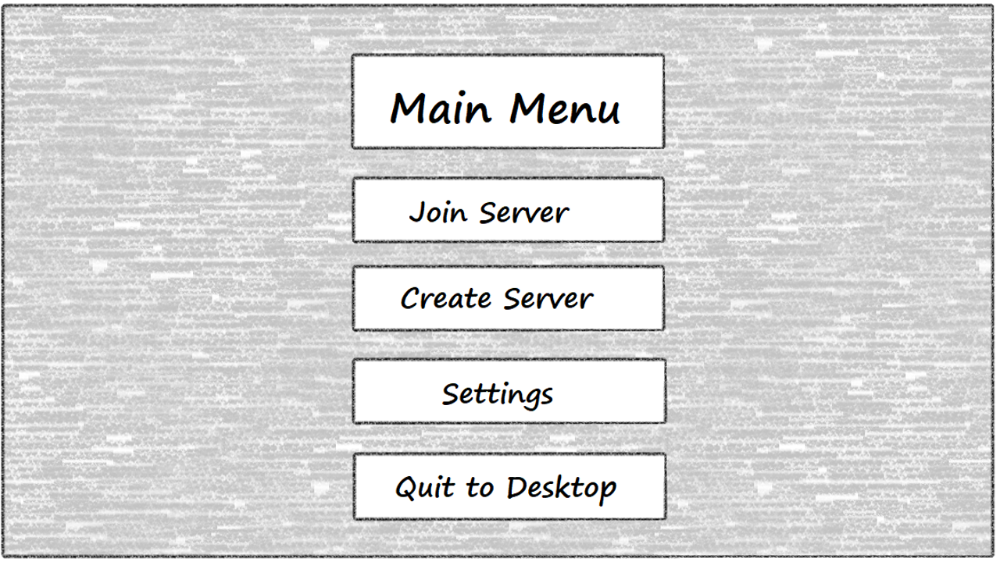
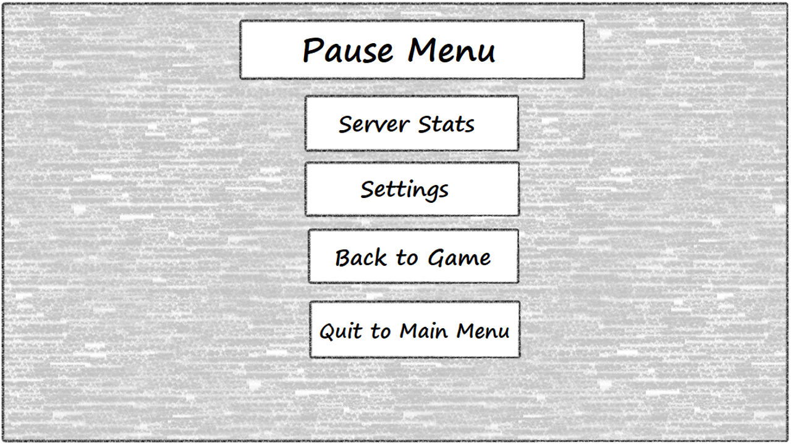
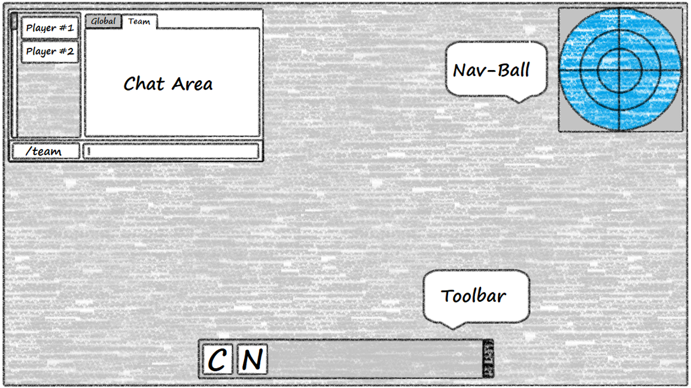

# **Open-Space-Game** 
_Open World, Open Space, Open Source :tm:_

This is the design document for the first Campaign for the open-space-game project.  This initial Campaign is more for getting the foundation laid for features that will come later.  The end result of this Campaign should be a multi-player game where two groups fight for control of contested areas.

# Table of Contents
* [Feature Set](#feature-set)
  * [General Features](#general-features)
  * [Multi-player Features](#multi-player-features)
  * [Editor](#editor)
* [Game Play](#game-play)
* [Game World](#game-world)
  * [Multiple Ship Types](#multiple-ship-types)
  * [Interactive Environment](#interactive-environment)
  * [Resource Management](#resource-management)
  * [Strategic Map](#strategic-map)
  * [Server Statistics](#server-statistics)
  * [Key Locations](#key-locations)
  * [Combat Radio Cone](#combat-radio-cone)
  * [Scale](#scale)
* [Characters](#characters)
  * [Creating a Character](#creating-a-character)
* [User Interface](#user-interface)
* [Musical Scores and Sound Effects](#musical-scores-and-sound-effects)
  * [Sound Track](#sound-track)
  * [Sound FX](#sound-fx)

# Feature Set

The following is a general overview of what a potential player can expect to find when they start playing open-space-game.

## General Features

* 3D Graphics
* Real-time physics
* Basic plug-in framework
* Basic modding infrastructure

## Multi-player Features

* Co-Operative/Competitive Game Play
* Host Finder
* Team/Global Communication

## Editor

* Allow additional assets to be created

# Game-Play

* Players control a single drone ship, of three possible ship types, which they choose before they enter the war-zone.  The ships will be powered using chemical engines and will follow physical rules ([Asteroids](https://en.wikipedia.org/wiki/Asteroids_(video_game))) versus arcade rules ([Galaga](https://en.wikipedia.org/wiki/Galaga)).

* Players earn credits by destroying opposing team ships who's payout is calculated by a minimum payment plus a bonus based on the player's rank.  NPC kills always payout the same pay, based on their AI tier.

* Asteroid particles are interactive with ship weaponry, allowing the player to change their direction and/or break off additional pieces that can cause damage to other ships in the area.  Asteroid particles will "replenish" from the rest of the cloud periodically.

* The three asteroid hulls are the focus of special harvesting events where Harvesters are sent out by both corporations to collect the resources from them for processing.   Players will be granted a credit payout for the total amount of ore that their side collects over the amount of the other team's harvester.   If both Harvesters return the same amount or both Harvesters are destroyed, there is no payout.

* The server will keep track of useful information about the number of kills scored, the number of deaths and the total amount of game time played from which a ranking list will be created.  This statistic information will be made available in the settings screen of the pause menu.

* Upon death there will be a time out period before the player is allowed to re-spawn and re-enter the game.

* A small number of NPC ships will be created and will lend assistance in conquering contested regions.

* Ships use fuel and ammunition for locomotion and attacking respectively.  The player will be given a warning at various consumption levels and will have to return to their team's base in order to restock.  Players will need to be mindful not to get stuck out in the middle of space without fuel, as only the destruction of their ship will allow them to rejoin the game.

# Game World

The player is set in the near future of space exploration where resource acquisition is little different than in the "Wild West" of the American 19th century.  As an employee of a minor mining operation, the player is teamed with others to fight over the reminisce of an asteroid that was striped and broken by a larger mining operation.

## Key Locations

The game will have one game area that is positioned in the broken reminisce of a larger asteroid.  The game area consists of floating asteroid particles lazily jostling about within their solar orbit while the massive fractured remains looms in the background.

### Harvest-able Asteroids
Asteroids large enough for the Harvesters to collect meaningful amount of resources.  These objects are static and offer an opportunity for a huge corporate payouts.

### Home Ships
Each team has a home ship that is located on opposing ends of the game area

### Randomly Generated Asteroid Clouds

At various points in the map, parts of the larger asteroid bodies have broken off and have drifted away.  Though small compared to the original body, they represent obstacles of varying degree to player and NPC ships.

## Multiple Ship Types

The game will offer three ships types for a player to choose from:

* [Dreadnought](https://en.wikipedia.org/wiki/Dreadnought) - Large, slow and armored.  This ship is meant to pack a real punch against enemy ship positions and any asteroids that might be in the area.
    * Heavily Armored
    * Large Turret Mounted Rail Cannons
    * 5 Microwave Power Emitters
    * Moves Slowly
* [Corvette](https://en.wikipedia.org/wiki/Corvette) - Midrange ship that is faster than a Dreadnought but also not as armored. Designed to be the fast attack group or defensive resistance on the front lines of combat.
    * Lightly Armored
    * Fixed Position Rail Cannons
    * 1 Externally Attached Torpedo
    * Moves Faster than the Dreadnought but slower than the Sentinel
* [Sentinel](https://en.wikipedia.org/wiki/Sentinel-class_cutter) - Is a small, agile ship with the greatest [Thrust-to-Mass](https://en.wikipedia.org/wiki/Thrust-to-weight_ratio) ratios of the three and trimmed with the latest in high-tech gadgetry.
    * No Armor
    * Twin Gatling Style, High RPM, Fixed Position Rail Guns
    * Electronic Surveillance and Jamming Equipment
        * This craft may only be optically detected
    * Fastest ship in the game
* [Harvester](https://en.wikipedia.org/wiki/Factory_ship) - These specialized ships are responsible for collecting resources from the asteroid reminisce.
    * Moderately armored
    * Autonomous Gatling Style, High RPM, Fixed Position Rail Guns
    * Same movement speed as a Corvette unloaded, movement like a Dreadnought when loaded

## Interactive Environment

The asteroids found within the reminisce cloud are interactive with the weaponry of both the Dreadnought and the Corvette; allowing those ship types to use them as a part of their combat strategy:

* Torpedo - Corvette torpedoes can be used to break apart larger asteroid particles or pulverize smaller ones into dust.
* Heavy Guns - Guns from the Dreadnought and the Corvette can be used to push asteroid particles around to change their direction and velocity.

Asteroids will follow the same physical model as the ships and will have inertia which will cause them to deal massive damage to the hull of any unfortunate ship to collide with one of them at speed.

## Resource Management

Just like in the real world, things in the game use other things to get work done.  Ships have chemical engines and thus require fuel, guns require ammunition to fire and all ships require electricity to power their vital equipment.

### Battery Power
* Corvettes and Sentinels are unable to generate power on their own (Dreadnought class vessels are equipped with nuclear power plants) and are required to get it directly from the sun or having it microwave transfered from a Dreadnought or Home Ships.
    * A Home Ship can transfer to an unlimited number of ships
    * A Dreadnought can transfer to up to 5 ships starting with those with the lowest battery level.

### Ammunition
* All ships require ammunition for their weapons that can be picked up from the player's home ship.

### Fuel
* All ships require fuel to move from place to place.  A player must be careful to not use so much fuel that they can no longer make it back to a home ship to refuel.
    * Dreadnought - Slow moving but have the largest fuel tanks of the three ships.
    * Corvette - Faster than the Dreadnought but a much reduced fuel tank.
    * Sentinel - Fastest and most efficient engines in the game but has the least amount of fuel storage.

## Strategic Map

A separate map mode that will allow the player to:

* Plot courses using maneuverer nodes
* View enemy and friendly craft positions by their energy signatures
* See shared intelligence information from the rest of the team

## Server Statistics

When the player creates an account on the server, the server will start to collect information about the kill/death ratios of the ships piloted by that player and the total amount of game time for each ship.  This information will be made available in the players pause menu.

In addition to the personal scores sheets, this data should be used to compile a server ranking list which can also be selected from the game's pause menu.

## Combat Radio Cone

Due to the large amounts of data required for reliable communication with the drones they must operate in a relatively short range and in line of sight of the home ship or another ship on the same team.

The different sides would rather destroy their drones then turn one over to the other side.

## Scale

The game objects should be 1 unit per meter and be at a 1:1 scale with known object sizes of belt objects.

# Characters

Game characters represent the player as a person living one of the home ships who has been commissioned to pilot their corporate drones in the protection and acquisition of resources from the asteroid reminisce.

## Creating a Character

Game characters are little different than their logins on the server and as such their user-name is also their call sign and how they will be represented in local and global communicators.

# User Interface

As this is the first iteration of the game there are going to be a large number of fundamental user interfaces that will need to be created.

## Load-screens

A simple load screen that has a gallery of images it scrolls through while the game loads any long-term memory items.

Instead of having funny little tags talking about what it is doing, we will give tag saying exactly what it is doing, maybe in a funny way.

## Main Menu

## Settings Menu

## Create Server

## Find Server

## Stats Screen

## Pause Menu

## Game Interface

### Game Camera

In this camera mode the camera will follow the ship as the player pilots it.  Within this mode there should be two sub-modes:

* Chase - This will follow the ship around with the forward movement vector traveling through the ship and the top of the ship being the up vector.
* Free - The camera locks to the ship but the player may orbit the camera in any direction around the ship
* First Person - This camera positions itself at the front of the craft and points at the forward vector

## Map Interface

### Maneuver Nodes

### Map Camera

In map mode the camera should be free form and should allow movement by using the ASDW keys for movement.  The player will not be able to see anything beyond what is being optically or electronically tracked by themselves or someone on their team.

# Musical Scores and Sound Effects

There are a number of royalty free music websites where sound tracks and effects can be reviewed.

## Sound Track

* [Music]
    * [HookSounds](https://www.hooksounds.com/royalty-free-music)
        * [Energetic Dubstep](https://www.hooksounds.com/royalty-free-music/energetic-dubstep/402905/)
        * [Extreme Dubstep](https://www.hooksounds.com/royalty-free-music/extreme-dubstep/434308/)
        * [Abstract Chill](https://www.hooksounds.com/royalty-free-music/abstract-chill/411567/)
        * [Abstract Electronic](https://www.hooksounds.com/royalty-free-music/abstract-electronic/290639/)
        * [Electronic Joy](https://www.hooksounds.com/royalty-free-music/electronic-joy/213158/)
        * [Innovative](https://www.hooksounds.com/royalty-free-music/innovate/165673/)
* [Ambient]
    * [Sound Image](http://soundimage.org/)
        * [They're Here (looping)](http://soundimage.org/sci-fi/)
        * [LIGHT YEARS_V001 (looping)](http://soundimage.org/sci-fi/)
        * [BLAZING STARS](http://soundimage.org/sci-fi/)

## Sound FX

* [UI]
    * [SciFi UI Sound FX](https://assetstore.unity.com/packages/audio/sound-fx/scifi-ui-sound-fx-27282)
    * [UI Sfx](https://assetstore.unity.com/packages/audio/sound-fx/ui-sfx-36989)

