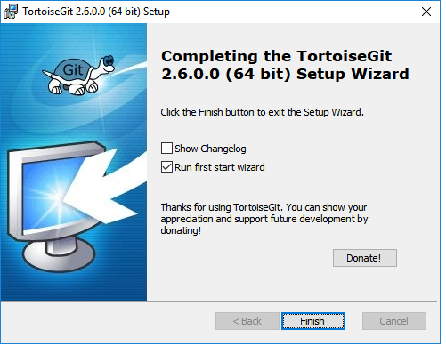
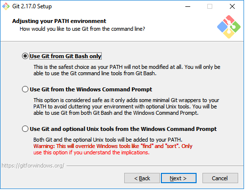
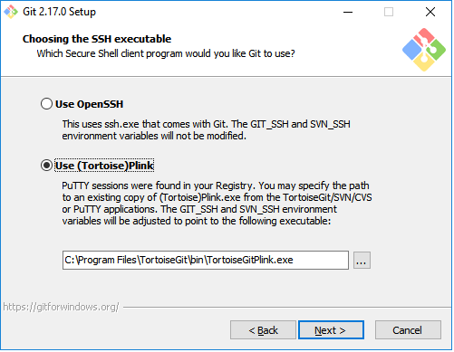
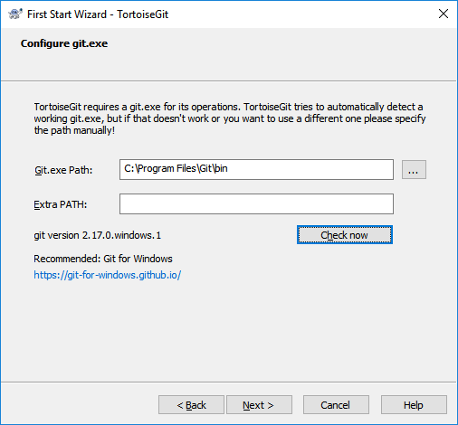
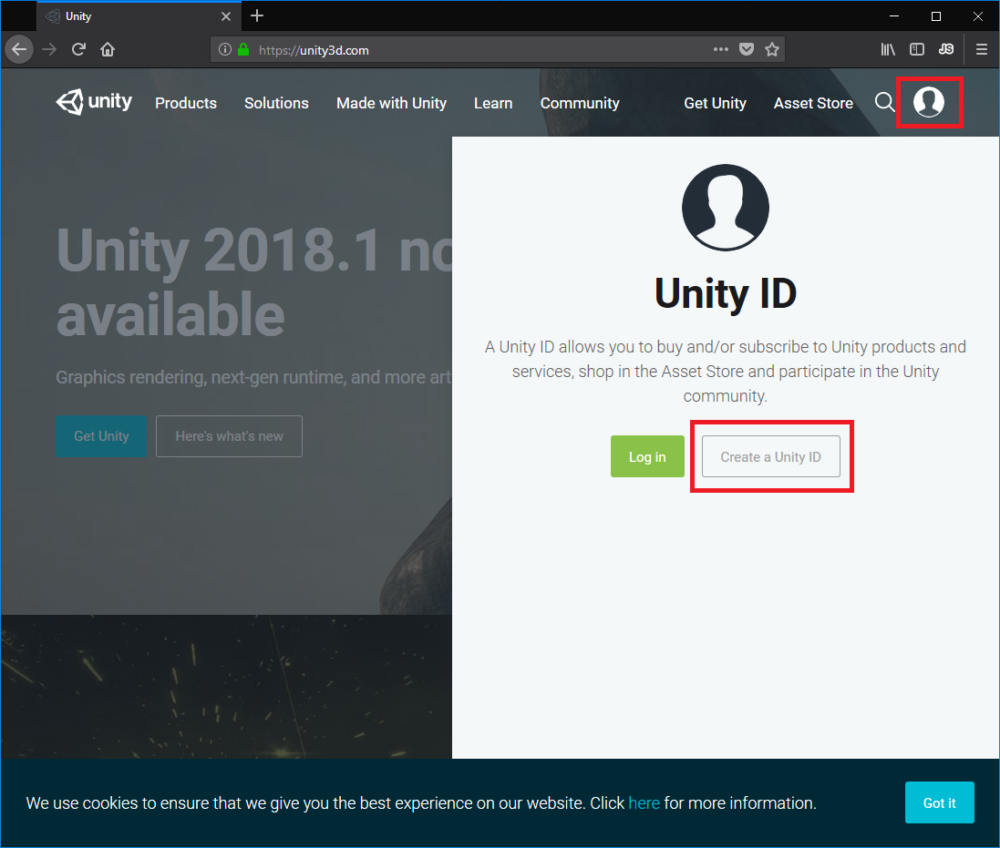
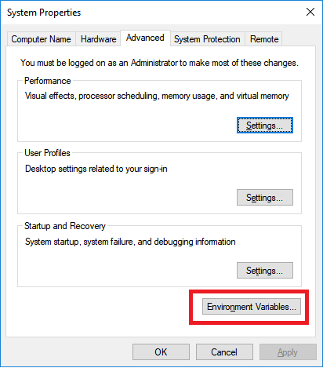
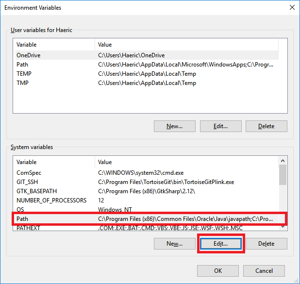
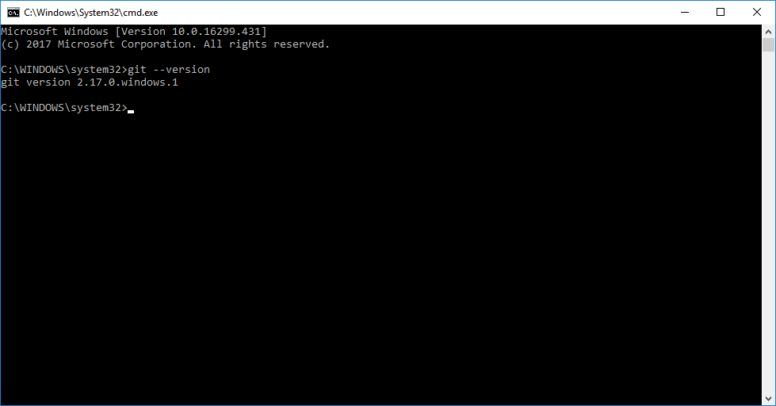

# Setting Up the Development Environment From Scratch

## Introduction

This guide should walk you though the process of setting up your open-space-game development environment from scratch. We make no assumptions about the skill level of the reader so in some cases this guide may seem pedantic.  We do make two assumptions in this guide, that the reader is using Windows 10 and has access to the Internet.

## Table of Contents
* [Prerequisites](#prerequisites)
* [Installing](#installation)
    * [TortoiseGit Part 1](#install-tortoisegit-part-1)
    * [Git](#install-git)
    * [TortioseGit Part 2](#install-tortoisegit-part-2)
    * [GitHub Desktop](#install-github-desktop)
    * [Sublime 3](#install-sublime-3)
    * [Unity Hub](#install-unity-hub)
* [Configuration](#configuration)
    * [Setup Paths](#configure-setup-paths)
    * [GPG ID](#configure-gpg-id)
* [Verification](#verification)
    * [Proper Git Path](#proper-git-path)
    * [TortoiseGit/GitHub Desktop](#verify-tort-github)

## Prerequisites

You will need to download the following programs:

* [Git Windows](https://git-scm.com/download/)
* [TortoiseGit 64bit](https://tortoisegit.org/download/)
* [Sublime 3 64bit](https://www.sublimetext.com/3)
* [GitHub Desktop](https://desktop.github.com/)
* [Unity Hub (Preview)](https://unity3d.com/get-unity/download)

## Installation

### TortoiseGit Part 1
You will start by installing TortioseGit and choosing the default options until you get to the end of the installation:

Before you click "Finish" make sure that the check box for "Run first start wizard" is selected, like in the image above, then click finish.

You will again select the default options until you get to where it asks you for the path to the git installation:

At this point we can go no further with TortoiseGit, so we'll move the window for it off to the side, and start the next installation.

### Git
Next you will install Git and, like before, we will allow it to use the default options.  You also will want to make sure that it installs to the location showing on the TortoiseGit Wizard screen (the default).  Continue with the defaults until it asks you about the console:

where you will choose to use "Git Bash" only and not the windows command prompt.  Next it will ask you what method to use for authentication and we will use Plink provided by TortoiseGit:

once that is selected you will allow the install wizard to finish out using default values.

### TortoiseGit Part 2
Now that you have Git installed we can return to our partially configured TortoiseGit and click the "Check Now" button.  If it looks like the below then you can click next to continue with the wizard:

When it prompts you for your information, provide it your GitHub user-name and email address:

You will continue and let the wizard finish out using only default values.

### GitHub Desktop
After tackling git and TortoiseGit this one will seem like cake.  [Install GitHub Desktop](https://help.github.com/desktop/guides/getting-started-with-github-desktop/installing-github-desktop/) and allow it to run through the setup wizard.

### Sublime 3
Though this is not technically a free program, it is free to evaluate ... forever.   It has some very powerful features that make it this project's go-to text editor.  If you really like it, you could also buy it :smile:.

### Unity Hub
After you install Unity Hub, you will be required to sign in order to use their product.  You can register for a free account by going to their [web page](https://www.unity3d.com) and clicking on the silhouette and then choosing "Create a Unity ID" button:

## Configuration

### Setup Paths

First we will tell Git that we would like it to use Sublime 3 for our text editor.  To do this, you will right click on some open space on the desktop and select "Git Bash Here".  In the prompt copy and paste the following then hit enter (there will be no response text):

* git config --global core.editor "'c:/program files/sublime text 3/subl.exe' -w"

Next we will need to setup the application paths.  Start by hitting the windows key and then typing "Advanced System Settings" and choosing it from the list:

Then choose "Environmental Variables":

Then you will want to choose the lower "Path" variable and hit the "Edit" button:

When the next prompt appears you will click the new button and then add for each of the two paths:

* C:\Program Files\Git\bin\git.exe
* C:\Program Files\Git\cmd

After you have finished setting up the file paths you should click ok until you are back to the desktop and then have the computer reboot.

### Create Your GPG ID

> It is highly recommended that for the following configuration that you use some form of password storing application to manage all the sensitive data you are about to create.  We have had experience with [KeePass](https://keepass.info/) but are free to use whatever you are familiar with.

One of the requirements for this projects is that all commits are "verified" by a GPG key.  To start this, we will right click on some open spot on the desktop and select "Git Bash Here".  With that prompt open you can follow the official [GitHub Instructions](https://help.github.com/articles/generating-a-new-gpg-key/), however, there is one caveat:

When the article tells you to type:

    * gpg --full-generate-key

Instead type:

    * gpg --gen-key

The bundled version of gpg seems to have lightly different command line options.

Once complete, follow the instructions for adding that GPG Key to your [GitHub Account](https://help.github.com/articles/adding-a-new-gpg-key-to-your-github-account/).

Once we have the GPG key create and installed on GitHub we will want to tell TortoisGit to use the key we have created.  Right click again on an open spot on the desktop but this time select "TortoiseGit > settings".  When the settings open, you are free to dismiss their hierarchical disclaimer, then find "Git" on the left and click it and then click the "Edit global .gitconfig" button:

Once the editor loads make sure that the following is in your global configuration.  You will of course want to use your own GitHub account settings and GPG ID (signingkey). Not all variables will be present so some will have to be added:

>* [commit] 
>	* gpgsign = true 
>* [user] 
>	* name = github.username 
>	* email = github.email 
>	* signingkey = github.gpgid 

## Verification

### Proper Git Path
First lets verify that we can call git from anywhere.  Hit the windows key, type "cmd" and then hit enter.  In the prompt type the following and hit enter again:

* git --version

The command prompt should then print the version of git you have installed:

### TortoisGit/GitHub Desktop
The best way to test these applications is to fork a project and start trying to manipulate your fork.  TortoiseGit is very powerful front end, however, for most tasks GitHub desktop is more than adequate.  The choice of which to use will come down to personal preference and how you use Git.  Feel free to experiment.

When you go to modify your repository of choice, ensure that your commits are "verified".  If yours are not, please go back over the relevant parts of this tutorial. if after reviewing this document (and the links) you are still unable to have you commits verified then seek help from someone on the [Discord](https://discord.gg/zk3NZEc) server
